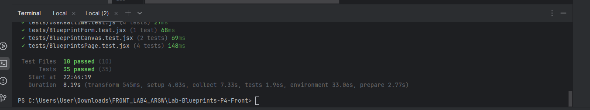
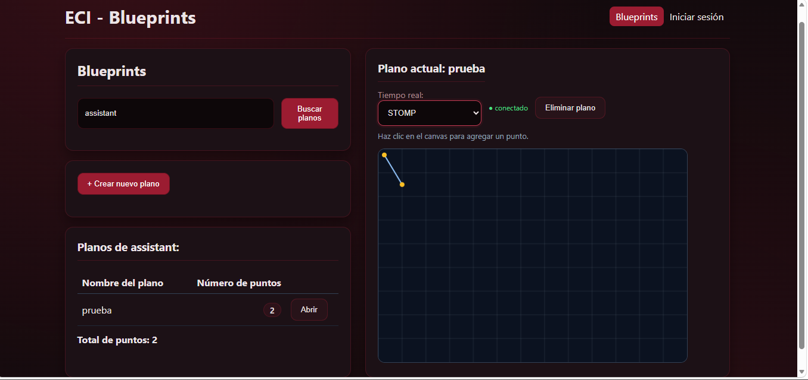

# Lab P4 — BluePrints en Tiempo Real (Sockets & STOMP)

### Juan Manuel Lopez Barrera- Laura Valentina Santiago Marquez 

> **Repositorio:** `DECSIS-ECI/Lab_P4_BluePrints_RealTime-Sokets`  
> **Front:** React + Vite (Canvas, CRUD, y selector de tecnología RT)  
> **Backends guía (elige uno o compáralos):**
> - **Socket.IO (Node.js):** https://github.com/DECSIS-ECI/example-backend-socketio-node-/blob/main/README.md
> - **STOMP (Spring Boot):** https://github.com/DECSIS-ECI/example-backend-stopm/tree/main

## 🎯 Objetivo del laboratorio
Implementar **colaboración en tiempo real** para el caso de BluePrints. El Front consume la API CRUD de la Parte 3 (o equivalente) y habilita tiempo real usando **Socket.IO** o **STOMP**, para que múltiples clientes dibujen el mismo plano de forma simultánea.

Al finalizar, el equipo debe:
1. Integrar el Front con su **API CRUD** (listar/crear/actualizar/eliminar planos, y total de puntos por autor).
2. Conectar el Front a un backend de **tiempo real** (Socket.IO **o** STOMP) siguiendo los repos guía.
3. Demostrar **colaboración en vivo** (dos pestañas navegando el mismo plano).

---

## 🧩 Alcance y criterios funcionales
- **CRUD** (REST):
    - `GET /api/blueprints?author=:author` → lista por autor (incluye total de puntos).
    - `GET /api/blueprints/:author/:name` → puntos del plano.
    - `POST /api/blueprints` → crear.
    - `PUT /api/blueprints/:author/:name` → actualizar.
    - `DELETE /api/blueprints/:author/:name` → eliminar.
- **Tiempo real (RT)** (elige uno):
    - **Socket.IO** (rooms): `join-room`, `draw-event` → broadcast `blueprint-update`.
    - **STOMP** (topics): `@MessageMapping("/draw")` → `convertAndSend(/topic/blueprints.{author}.{name})`.
- **UI**:
    - Canvas con **dibujo por clic** (incremental).
    - Panel del autor: **tabla** de planos y **total de puntos** (`reduce`).
    - Barra de acciones: **Create / Save/Update / Delete** y **selector de tecnología** (None / Socket.IO / STOMP).
- **DX/Calidad**: código limpio, manejo de errores, README de equipo.

---

## 🏗️ Arquitectura (visión rápida)

```
React (Vite)
 ├─ HTTP (REST CRUD + estado inicial) ───────────────> Tu API (P3 / propia)
 └─ Tiempo Real (elige uno):
     ├─ Socket.IO: join-room / draw-event ──────────> Socket.IO Server (Node)
     └─ STOMP: /app/draw -> /topic/blueprints.* ────> Spring WebSocket/STOMP
```

**Convenciones recomendadas**
- **Plano como canal/sala**: `blueprints.{author}.{name}`
- **Payload de punto**: `{ x, y }`

---

## 📦 Repos guía (clona/consulta)
- **Socket.IO (Node.js)**: https://github.com/DECSIS-ECI/example-backend-socketio-node-/blob/main/README.md
    - *Uso típico en el cliente:* `io(VITE_IO_BASE, { transports: ['websocket'] })`, `join-room`, `draw-event`, `blueprint-update`.
- **STOMP (Spring Boot)**: https://github.com/DECSIS-ECI/example-backend-stopm/tree/main
    - *Uso típico en el cliente:* `@stomp/stompjs` → `client.publish('/app/draw', body)`; suscripción a `/topic/blueprints.{author}.{name}`.

---

## ⚙️ Variables de entorno (Front)
Crea `.env.local` en la raíz del proyecto **Front**:
```bash
# REST (tu backend CRUD)
VITE_API_BASE=http://localhost:8080

# Tiempo real: apunta a uno u otro según el backend que uses
VITE_IO_BASE=http://localhost:3001     # si usas Socket.IO (Node)
VITE_STOMP_BASE=http://localhost:8080  # si usas STOMP (Spring)
```
En la UI, selecciona la tecnología en el **selector RT**.

---

## 🚀 Puesta en marcha

### 1) Backend RT (elige uno)

**Opción A — Socket.IO (Node.js)**  
Sigue el README del repo guía:  
https://github.com/DECSIS-ECI/example-backend-socketio-node-/blob/main/README.md
```bash
npm i
npm run dev
# expone: http://localhost:3001
# prueba rápida del estado inicial:
curl http://localhost:3001/api/blueprints/juan/plano-1
```

**Opción B — STOMP (Spring Boot)**  
Sigue el repo guía:  
https://github.com/DECSIS-ECI/example-backend-stopm/tree/main
```bash
./mvnw spring-boot:run
# expone: http://localhost:8080
# endpoint WS (ej.): /ws-blueprints
```

### 2) Front (este repo)
```bash
npm i
npm run dev
# http://localhost:5173
```
En la interfaz: selecciona **Socket.IO** o **STOMP**, define `author` y `name`, abre **dos pestañas** y dibuja en el canvas (clics).

---

## 🔌 Protocolos de Tiempo Real (detalle mínimo)

### A) Socket.IO
- **Unirse a sala**
```js
  socket.emit('join-room', `blueprints.${author}.${name}`)
```
- **Enviar punto**
```js
  socket.emit('draw-event', { room, author, name, point: { x, y } })
```
- **Recibir actualización**
```js
  socket.on('blueprint-update', (upd) => { /* append points y repintar */ })
```

### B) STOMP
- **Publicar punto**
```js
  client.publish({ destination: '/app/draw', body: JSON.stringify({ author, name, point }) })
```
- **Suscribirse a tópico**
```js
  client.subscribe(`/topic/blueprints.${author}.${name}`, (msg) => { /* append points y repintar */ })
```

---

## ✅ Lo que implementamos (equipo)

**Tecnología RT elegida:** STOMP, porque el backend ya está en Spring Boot y se integra en el mismo proceso, reutilizando la seguridad, el CORS y la base de datos que ya existían (evita levantar un servidor Node aparte para Socket.IO).

### Backend
Repo: https://github.com/JuanLopezTW/Lab-Blueprints-P4-Back
- Endpoint WebSocket: `ws://localhost:8080/ws-blueprints`
- Publicar: `/app/draw` — Suscribirse: `/topic/blueprints.{author}.{name}`
- Payload: `{ "author": "...", "name": "...", "point": { "x": 0, "y": 0 } }`
- REST base: `/api/v1/blueprints`, protegido con JWT (`blueprints.read` / `blueprints.write`)

### Frontend
Repo: https://github.com/JuanLopezTW/Lab-Blueprints-P4-Front

- `src/services/stompClient.js`: conexión WebSocket única compartida en toda la app, con reconexión automática.
- `src/hooks/useRealtime.js`: hook que se suscribe al tópico del plano abierto y expone `sendPoint(point)` para publicar. Se desactiva si el modo RT está en "None" o no hay plano abierto.
- `BlueprintCanvas.jsx`: se agregó el prop `onPointClick` para dibujar por clic, calculando las coordenadas reales según el tamaño del canvas en pantalla.
- `apiClient.js`: se completó el CRUD con `addPoint` (`PUT .../points`) y `remove` (`DELETE ...`).
- Selector RT con opciones **None** y **STOMP**, con indicador de estado de conexión en vivo (conectado / conectando).

### Pruebas realizadas
- Estado inicial del canvas al abrir un plano (GET).
- Dibujo local por clic.
- Colaboración en vivo verificada con dos pestañas en el mismo plano: los puntos se replican casi al instante.
- Aislamiento por plano verificado: dibujar en un plano no afecta a pestañas con un plano distinto abierto.
- CRUD completo (crear, abrir, dibujar, eliminar) funcionando y refrescando la tabla y el total de puntos.
- Usuario `student` (solo lectura) recibe `403` al intentar dibujar, confirmando que el control de scopes sigue aplicando.

### Pruebas unitarias nuevas (Vitest)
- `useRealtime.test.js`: conexión condicionada por `enabled`, suscripción correcta, y `sendPoint` publicando el payload esperado.
- `apiClient.test.js`: `addPoint` y `remove` llaman a las rutas REST correctas.
- `BlueprintCanvas.test.jsx`: clic en el canvas calcula bien las coordenadas del punto.

Todas las pruebas pasaron con `npm test`.





---

## 🧪 Casos de prueba mínimos
- **Estado inicial**: al seleccionar plano, el canvas carga puntos (`GET /api/blueprints/:author/:name`).
- **Dibujo local**: clic en canvas agrega puntos y redibuja.
- **RT multi-pestaña**: con 2 pestañas, los puntos se **replican** casi en tiempo real.
- **CRUD**: Create/Save/Delete funcionan y refrescan la lista y el **Total** del autor.

---

## 📊 Entregables del equipo
1. Código del Front integrado con **CRUD** y **RT** (Socket.IO o STOMP).
2. **Video corto** (≤ 90s) mostrando colaboración en vivo y operaciones CRUD.
3. **README del equipo**: setup, endpoints usados, decisiones (rooms/tópicos), y (opcional) breve comparativa Socket.IO vs STOMP.

---

## 🧮 Rúbrica sugerida
- **Funcionalidad (40%)**: RT estable (join/broadcast), aislamiento por plano, CRUD operativo.
- **Calidad técnica (30%)**: estructura limpia, manejo de errores, documentación clara.
- **Observabilidad/DX (15%)**: logs útiles (conexión, eventos), health checks básicos.
- **Análisis (15%)**: hallazgos (latencia/reconexión) y, si aplica, pros/cons Socket.IO vs STOMP.

---

## 🩺 Troubleshooting
- **Pantalla en blanco (Front)**: revisa consola; confirma `@vitejs/plugin-react` instalado y que `AppP4.jsx` esté en `src/`.
- **No hay broadcast**: ambas pestañas deben hacer `join-room` al **mismo** plano (Socket.IO) o suscribirse al **mismo tópico** (STOMP).
- **CORS**: en dev permite `http://localhost:5173`; en prod, **restringe orígenes**.
- **Socket.IO no conecta**: fuerza transporte WebSocket `{ transports: ['websocket'] }`.
- **STOMP no recibe**: verifica `brokerURL`/`webSocketFactory` y los prefijos `/app` y `/topic` en Spring.

---

## 🔐 Seguridad (mínimos)
- Validación de payloads (p. ej., zod/joi).
- Restricción de orígenes en prod.
- Opcional: **JWT** + autorización por plano/sala.

---

## 📄 Licencia
MIT (o la definida por el curso/equipo).
